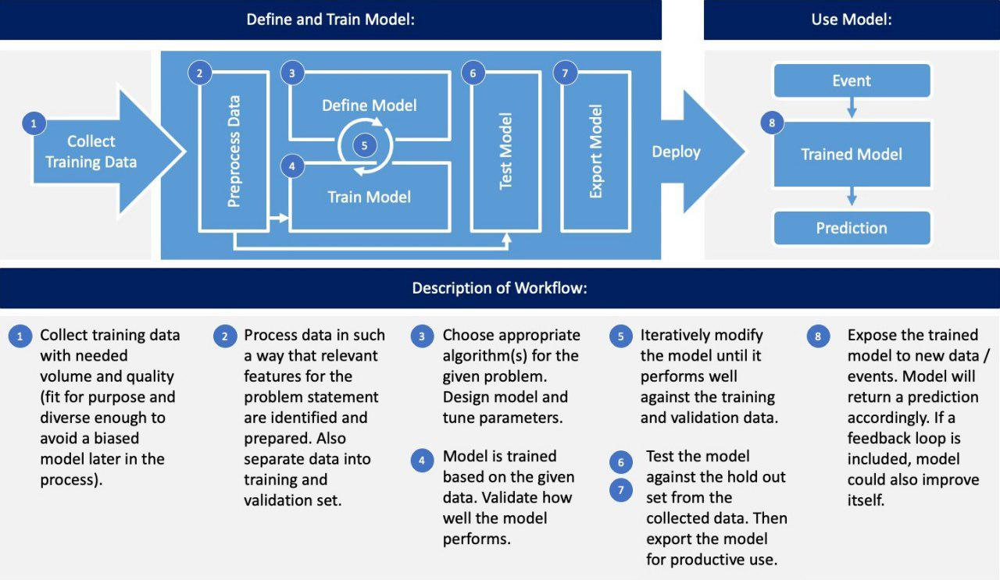

# ET3107 Advance Programming

Repo ini dibuat sebagai wadah kerja dan hasil tugas mata kuliah pemrogramman lanjut ET3107 untuk kelompok **Dewa Mahardika** dan **Dian Shafira Khoirunnisa**. 

# TUBES

Folder tubes berisi hasil tugas besar AI kelompok ini. AI yang dibuat mengambil jenis Natural Language Processing untuk membuat sebuah **Tweet Emotion Classifier**. AI ini mengidentifikasi apakah suatu teks (dalam hal ini tweet) merupakan kalimat "*toxic, evere_toxic", "obscene", "threat", "insult" dan "identity_hate*". Model ini dibuat dengan metode **deep learning recurrent neural network**. Pada tugas in kami menggunakan library [Keras](https://keras.io/) dan framework [Tensorflow](https://www.tensorflow.org/) untuk membangun model.

## [Text Sentiment Classifier with Natural Language Processing.ipynb](https://github.com/dedika4/Pemrograman-Lanjut-ET3107-Dewa-Mahardika-Dian-Shafira-Khoirunnisa/blob/master/TUBES/Text%20Sentiment%20Classifier%20with%20Natural%20Language%20Processing.ipynb "Text Sentiment Classifier with Natural Language Processing.ipynb")
Ini adalah file jupyter notebook dari tubes ini yang berisi praproses data, training model dan evaluasi model.

## [model1_FIX1.h5](https://github.com/dedika4/Pemrograman-Lanjut-ET3107-Dewa-Mahardika-Dian-Shafira-Khoirunnisa/blob/master/TUBES/model1_FIX1.h5 "model1_FIX1.h5")

Ini adalah file model yang sudah ditrain dan di save sehingga siap dipakai

## [tokenizer.pickle](https://github.com/dedika4/Pemrograman-Lanjut-ET3107-Dewa-Mahardika-Dian-Shafira-Khoirunnisa/blob/master/TUBES/tokenizer.pickle "tokenizer.pickle")

file ini adalah tokenizer dari model yang digunakan. File ini diperlukan untuk menguji sebuah kasus pada model. Untuk menggunakan file ini diperlukan library python **Pickle**

## [train.csv](https://github.com/dedika4/Pemrograman-Lanjut-ET3107-Dewa-Mahardika-Dian-Shafira-Khoirunnisa/blob/master/TUBES/train.csv "train.csv")

File ini adalah dataset yang digunakan pada tugas besar ini. File ini bisa ditemukan [disini](https://www.kaggle.com/c/jigsaw-toxic-comment-classification-challenge/overview).

# Pandas Tutorial

Berisi latihan - latihan penggunaan library [pandas](https://pandas.pydata.org/) pada Python untuk data science

# OTHER

Beberapa file lain adalah tutorial dan coba coba mandiri pada jupyter notebook. Ada juga tugas basic python membuat [converter bahasa alay](https://github.com/dedika4/Pemrograman-Lanjut-ET3107-Dewa-Mahardika-Dian-Shafira-Khoirunnisa/blob/master/Tugas%20Kelompok%20Alay.ipynb "Tugas Kelompok Alay.ipynb"). Untuk tugas pengolahan data pemilihan rektor ITB 2019 bisa dicek [disini](https://github.com/dedika4/pull-et3107).

# Resource and Reference

Tugas dan coba - coba mandiri yang ada di repo ini merujuk pada sumber sumber di bawah ini. 

-  [http://eueung.github.io/EL6240/py/#1](http://eueung.github.io/EL6240/py/#1)
-  https://github.com/pygame/pygame
	https://github.com/nikhilkumarsingh/pygameTut
- https://www.datacamp.com/community/blog/python-pandas-cheat-sheet
- https://data36.com/pandas-tutorial-1-basics-reading-data-files-dataframes-data-selection/
- https://data36.com/pandas-tutorial-2-aggregation-and-grouping/
- https://data36.com/pandas-tutorial-3-important-data-formatting-methods-merge-sort-reset_index-fillna/
- https://zellwk.com/blog/resolving-git-conflicts/
- https://scipy-lectures.org/intro/numpy/index.html
- https://scipy-lectures.org/intro/numpy/
- https://github.com/eueung/pilrek).
 https://eueung.github.io/pilrek
- https://docs.scipy.org/doc/scipy/reference/tutorial/linalg.html
- http://scipy-lectures.org/packages/statistics/index.html
- http://www.r2d3.us/visual-intro-to-machine-learning-part-1/
-  
	
- https://github.com/amueller/scipy-2018-sklearn.git
- [https://stackabuse.com/python-for-nlp-multi-label-text-classification-with-keras/](https://stackabuse.com/python-for-nlp-multi-label-text-classification-with-keras/)
